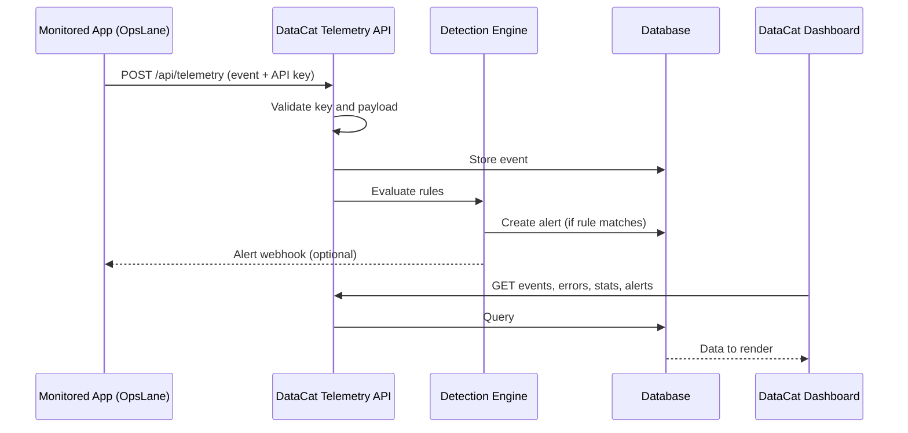
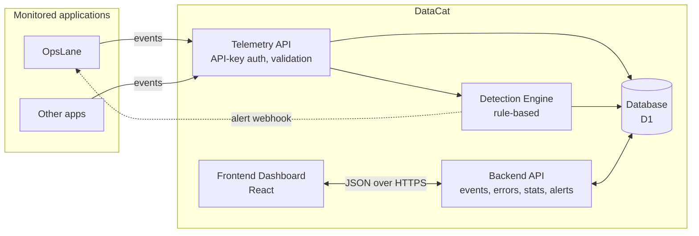

# 🐱 DataCat

**Application telemetry and cybersecurity monitoring platform.**

DataCat receives telemetry from applications, stores it, analyses it with detection rules, and shows everything in one real-time dashboard. Teams can see what their software is doing, spot attacks early, and manage alerts from detection to resolution.

The first monitored application is **OpsLane**, but DataCat is built to monitor any number of applications.

---

## What DataCat does

An application sends events to DataCat: requests, errors, logins, permission failures and more. DataCat then:

1. **Collects** the events through a secured telemetry API
2. **Stores** them in a database
3. **Analyses** them with rule-based detection (for example, repeated failed logins)
4. **Displays** metrics, logs, errors, users and security events on a dashboard
5. **Alerts** the team, and can notify the monitored application back

DataCat **observes** applications and their users. It does not manage them.

---

## Features

### Monitoring
| Feature | Description |
|---|---|
| **Overview** | Key metrics (events, requests, errors, users, alerts), event-volume chart, application health |
| **Events / Logs** | Searchable stream of all telemetry, filtered by level, type and time range |
| **Errors** | Grouped errors with occurrence count, first/last seen, affected users, endpoint and stack trace |
| **Requests** | Traffic, latency, status codes and top endpoints |
| **Users** | Total, new and active users, with growth charts |

### Security
| Feature | Description |
|---|---|
| **Authentication** | `login.success`, `login.failed`, `logout`, `password.changed`, `password.reset` |
| **Security events** | `permission.denied`, `rate_limit.exceeded`, `suspicious.request`, `api_key.created`, `api_key.revoked` |
| **Detection rules** | Configurable rules that turn raw events into security signals |
| **Alerts** | Severity, status, related events and a full lifecycle: Open → Investigating → Resolved / False Positive |

### Configuration
| Feature | Description |
|---|---|
| **Applications** | Register applications and environments (production, development) |
| **API keys** | Create and revoke the keys applications use to send telemetry |
| **Account** | DataCat user login, logout and profile |

---

## How it works



**Example:** an attacker fails to log in to OpsLane 7 times in 40 seconds. OpsLane sends seven `login.failed` events. The detection engine matches the brute-force rule (5 failures in 60 seconds from one IP), creates a **High** alert, and the dashboard shows it in the alert queue with the related events as evidence.

---

## System architecture



### Components

| Component | Responsibility |
|---|---|
| **Telemetry API** | Receives events, checks the application API key, validates the payload, rejects oversized or malformed data |
| **Backend API** | Serves events, logs, errors, user stats, alerts and application settings to the dashboard |
| **Detection engine** | Runs rules over incoming events and creates alerts |
| **Database** | Stores applications, API keys, events, errors, alerts and aggregated statistics |
| **Frontend dashboard** | Renders all pages from normalized data |
| **Auth service** | Handles DataCat user accounts, separate from application API keys |

### Frontend data flow

The dashboard never depends on a specific data source:

```
Data source (JSON now, API later) → Adapter / validator → App state → UI components
```

Because the UI only reads normalized data, the source can change from a local JSON file to the real API without rewriting any page.

---

## Technology stack

| Layer | Technology |
|---|---|
| Frontend | React with Vite, JavaScript/TypeScript, CSS |
| Charts | Lightweight SVG-based charts |
| Backend | Cloudflare Workers (REST + JSON) |
| Database | Cloudflare D1 (SQLite) |
| Hosting | Cloudflare Pages + Workers |
| Auth | Application API keys (`X-DATACAT-KEY`); DataCat user accounts with sessions |
| Detection | Rule-based logic, no ML or AI |
| Alert delivery | HMAC-signed webhooks |

---

## Telemetry data model

Every event follows one standard shape:

```json
{
  "id": "evt_001",
  "application": "opslane",
  "timestamp": "2026-10-01T12:32:15Z",
  "type": "login.failed",
  "level": "warning",
  "message": "Failed login attempt",
  "user": { "id": "usr_123" },
  "request": { "method": "POST", "endpoint": "/api/auth/login", "status": 401 },
  "network": { "ip": "192.168.1.50" },
  "metadata": {}
}
```

**Main entities:** applications, api_keys, events, errors, alerts, users, and hourly aggregates for fast charts.

---

## Detection rules

| Rule | Condition | Severity |
|---|---|---|
| Brute force | 5 failed logins within 60 s, same IP | High |
| Error spike | 20 errors within 60 s | Medium |
| Permission abuse | Multiple 403 responses, same user or IP | Medium |
| Suspicious request | Suspicious request pattern | High |
| Traffic spike | Requests exceed threshold | Medium |

Planned additions: password spraying (one IP, many users) and credential stuffing (many IPs, one user).

---

## API overview

**Ingestion**
```
POST /api/telemetry          Header: X-DATACAT-KEY: <application key>
```

**Dashboard**
```
GET  /api/events        GET  /api/logs        GET  /api/errors
GET  /api/users/stats   GET  /api/alerts      GET  /api/stats
```

**Alert delivery to the monitored app**
```
POST /api/telemetry/alerts   { alert_id, type, severity, application, message }
```

---

## Security design

- Each API key belongs to one application; keys are stored hashed and never shown again
- Rate limiting and payload size limits on ingestion
- Schema validation and duplicate protection by event `id`
- Server-side `receivedAt` time instead of trusting client timestamps
- All telemetry is escaped before display, with a Content Security Policy
- Sensitive data (passwords, tokens) is never stored; IPs can be truncated or hashed
- Webhooks are signed so applications can verify they come from DataCat

---

## Planned project structure

```
datacat/
├── frontend/          # React dashboard (pages, components, charts, adapters)
├── backend/           # Workers: telemetry API, dashboard API, detection engine
├── database/          # D1 schema and migrations
├── data/              # Sample telemetry JSON for development
├── docs/              # Architecture notes, schema, screenshots
└── README.md
```

---

## Development phases

| Phase | Goal |
|---|---|
| 1 | Frontend dashboard driven by sample JSON |
| 2 | OpsLane sends real telemetry to a public, key-protected API |
| 3 | DataCat backend: receive, validate, store, retrieve |
| 4 | Database (D1) replaces JSON |
| 5 | DataCat user authentication and application management |
| 6 | Live detection rules and alerts |
| 7 | Alert delivery back to OpsLane via webhook |

**Key principle:** build `JSON → DataCat UI` first, then replace the source step by step until it becomes  
`OpsLane → Telemetry API → Backend → Database → Dashboard`.

---

## Scope

**Not included:** infrastructure monitoring (CPU, memory), AI/ML detection, managing the monitored application's users, multi-tenant organizations.

## License

To be decided (for example, MIT).
